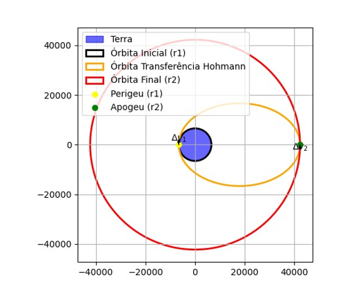

# transferencia_de_Hohmann
# Visualização orbital gráfica da transferência de Hohmann

Este repositório contém um script em Python que permite a visualização gráfica da **manobra de transferência de Hohmann**, utilizada para mover uma espaçonave entre duas órbitas circulares ao redor da Terra com eficiência energética.

##  Descrição

A transferência de Hohmann é uma manobra orbital amplamente empregada em missões espaciais para realizar mudanças de órbita com o menor gasto possível de combustível. Este projeto:

- Solicita os raios das órbitas inicial (`r1`) e final (`r2`);
- Calcula a órbita elíptica de transferência;
- Gera um gráfico com:
  - A Terra no centro;
  - As órbitas circular inicial e final;
  - A elipse da transferência de Hohmann;
  - Vetores de impulso (`Δv₁` e `Δv₂`);
  - Perigeu e apogeu destacados.

##  Exemplo de Aplicação

Este script é útil para:

- Demonstrações didáticas em cursos de Mecânica Orbital;
- Projetos acadêmicos em engenharia aeroespacial;
- Simulações simples de trajetórias orbitais.

##  Exemplo

Digite os valores solicitados:

Digite o raio da órbita inicial (r1) em km: (ex: 6578)

Digite o raio da órbita inicial (r2) em km: (ex: 42250)

You can reach me at rmilhomem[at]gmail[dot]com or connect on [LinkedIn](https://www.linkedin.com/in/rodolfo-space-force/) for collaborations.

## Licença

Este projeto está licenciado sob a Licença MIT. Você pode usar, modificar e redistribuir este código livremente, desde que mencione o autor original.

